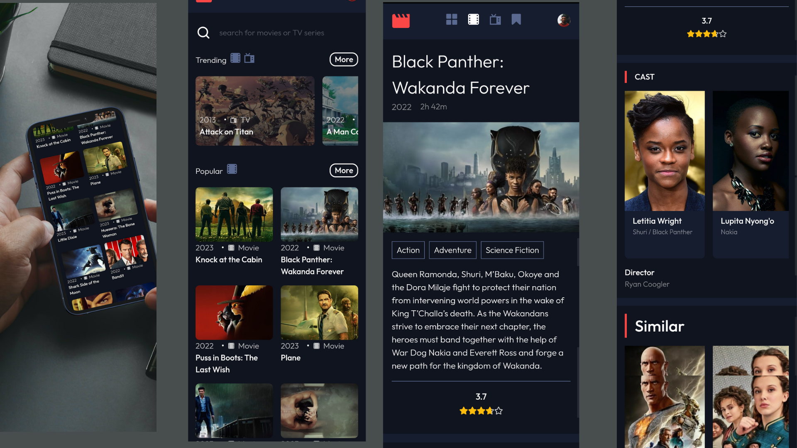
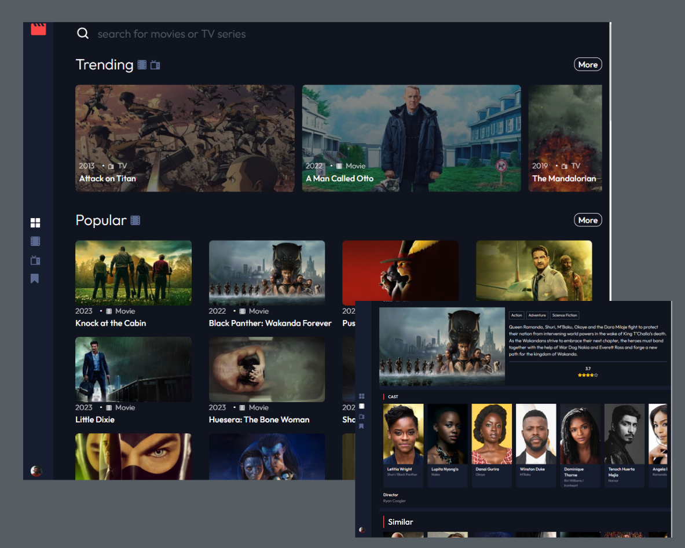

# Frontend Mentor - Entertainment web app solution

## Table of contents

- [Overview](#overview)
  - [Description](#the-challenge)
  - [Screenshot](#screenshot)
  - [Links](#links)
- [My process](#my-process)
  - [Built with](#built-with)
  - [What I learned](#what-i-learned)
  - [Continued development](#continued-development)
  - [Useful resources](#useful-resources)
- [Author](#author)
- [Acknowledgments](#acknowledgments)

## Overview

### Description

Netcine is a web app that enables user see trending, popular, top rated movies and get a more descriptive information about a movie.
It also includes a search feature that enables user search for movies and TV show of their choice while it provides users with infinite scroll
on the more page.

### Screenshot

### mobile



### Desktop



### Links

- Solution URL: [https://github.com/michael-2509/Netcine](https://your-solution-url.com)
- Live Site URL: [https://netcine.netlify.app](https://your-live-site-url.com)

### Built with

- Mobile-first workflow
- [React](https://reactjs.org/) - JS library
- [Tailwind](https://tailwindcss.com/) - Utility-first CSS framework.
- [Styled Components](https://styled-components.com/) - For styles

### What I learned

#### Sketch Loader

I have always admire how skeleton loader appear while i wait for content to load on the web page. The first time i noticed this was on binance
and I thought that it would be good to try this out here. So instead of using the traditional loading spinner I went for the sekeleton loader be
cause it keeps the user engage reducing the load time frustration by reducing the load time and focusing on progress. I love it beacause it mimicks the UI page layout. it great because of its flexibility but can be of disadvantage if you have a separate skeleton file and a more complex UI.

**STEPS**

- Install `react-loading-skeleton` next import the component below to the file you want to implement the loader

```
import Skeleton, { SkeletonTheme } from "react-loading-skeleton";
import "react-loading-skeleton/dist/skeleton.css";
```

skeleton is the component that is used in the place of the content that is loading. it contains properties that enable you create the kind of shape you want while skeletontheme is a wrapper component that must wrap your skeleton component to give it highligh color and a prefered color. The .css file is needed for the styles to reflect

- Create your UI

```
<SkeletonTheme color="grey" highlightColor="#444">
  <p>
    <Skeleton height={250} width={300} count={1} />
  </p>

</SkeletonTheme>
```

checkout this documentation for more explanation [Skeleton loading](https://www.smashingmagazine.com/2020/04/skeleton-screens-react/)

#### stlying an SVG image in an image tag

Using an SVG image in an image tag made learn a new trick i didn't knnow existed. I faced a problem of having to style my icons on hover. Using the color property won't just work. So, after a little bit of googling, i ended up with a the css filter property. CSS filter is a property that enables you to apply visual effects to HTML elements. The filter property accepts various functions to manipulate the appearance of an element, including blurring, color shifting, and saturation. Manipulating the functions to get the desire color was quite challenging but a found this hex to filter converted that reduced the stress. [Hex to Filter](https://codepen.io/sosuke/pen/Pjoqqp)

#### Infinite Scroll

From not knowing which to go for between the regular pagination and infinite scroll to deciding what method to employ to apply the logic. I ended up with infinite scroll because i just love it and it appears on mostly recent app for examlple, instagram, linkedIn and so on. Giving a non subjective point of view infinite scroll is great because When you reach the end of the page, it automatically detects this and loads additional content using Ajax and other asynchronous data fetching methods. Modern applications benefit greatly from infinite scrolling since it only shows a small portion of the data on page load and then fetches additional data as the user scrolls down the page, making the application quick. For handling lists of items including text, photographs, videos, status updates, feeds, and table data, infinite scroll typically works quite well.
Detecting when a user gets to the bottom was almost a hssle but i used the window event method for this logic regardles you can ty the intersection observer API.

to learn more about [Infinte scroll](https://betterprogramming.pub/how-to-create-a-custom-useinfinitescroll-with-react-hooks-248f4531384c)

### Continued development

- I plan to improve the infinite scroll logic and skeleton loading
- I plan to implement a keypad search and a natural language search
- I plan to implement an actual streaming feature

### Useful resources

- [Star Rating](https://www.npmjs.com/package/react-simple-star-rating) - This react library helped me to implement the star rating. I really liked this because i do not have to create my stars from scratch.
- [what is .env ](https://medium.com/how-to-react/using-env-file-in-react-js-b2714235e77e) - This is a simple article which helped me finally understand how to add .env.

## Author

- Website - [Adigun Michael](https://portfolio2509.netlify.app/)
- Frontend Mentor - [@michael-2509](https://www.frontendmentor.io/profile/michael-2509)
- Twitter - [@dr_brown_007](https://twitter.com/dr_brown_007)

## Acknowledgments

Thanks to [josh](https://github.com/jkellerman) and [hooiyan](https://github.com/hooiyan) whose solutions provided great help to me when implementing difficult concepts infinite scroll and some tailwind configuration respectively.

Shoutout to [@AlexKMarshall](https://www.frontendmentor.io/profile/AlexKMarshall) who helped me in seeing other approaches to implementing infinite scroll using tanstack query and intersection observer. Definitely checking these two in my next project!
